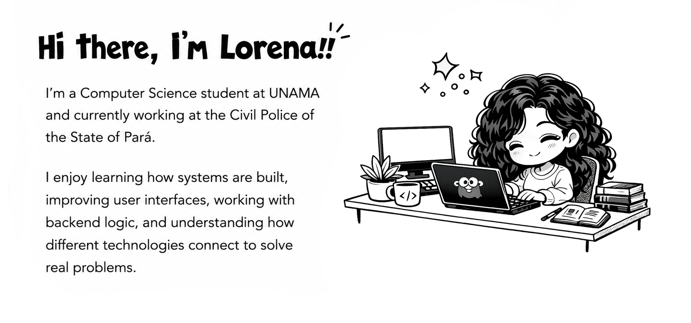

I'm building my path in software development, working with technologies such as **Laravel**, **Vue.js**, **React**, **Python**,**Node.js** and **Golang**.  

---

## Current Focus

- **Backend Development:** Laravel, PHP, Python, Node.js and Golang
- **Frontend Development:** Vue.js, React, JavaScript, HTML and CSS
- **Databases:** PostgreSQL and SQL
- **Professional Experience:** Working on systems at Polícia Civil do Estado do Pará
- **Learning:** Clean code, APIs, software architecture and modern web development

---

## Technologies

---

## About Me

I like studying programming, creating practical solutions, and improving my skills step by step.  
My goal is to become a better developer by working on real projects, learning from experience, and building systems that are useful, organized, and easy to maintain.

---
